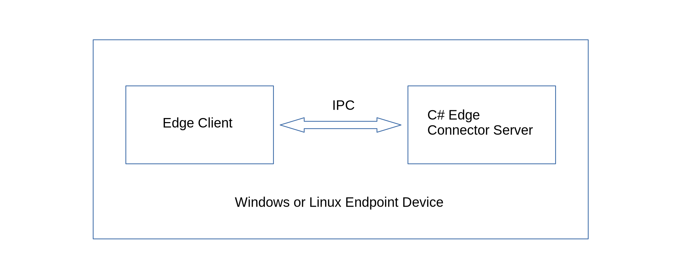

## Edge C# Connector Application (Linux or Windows endpoint)


In this quick tour, the edge client will attempt to capture data from a C# connector application through inter-process communication (IPC).
The client will send a standard json payload {topic:"random-data", value:""} to the connector server where it will provide the random value. 

### Download the *CsharpEdgeConnector* demo example project.
```js
$ git clone https://github.com/Node-M2M/CsharpEdgeConnector.git
```

### Edge Tcp C# Connector Device Setup

#### 1. Go inside the *device* sub-directory. 
Check and verify the *Program.cs* source file is the the same as shown below.

```js
using System;  
using System.Net;  
using System.Net.Sockets;  
using System.Text;  
using System.Threading;  
using System.Text.Json;
using System.Text.Json.Nodes;
using System.Text.Json.Serialization;

namespace serverLib.TcpServerAsync{
      
    // State object for reading client data asynchronously  
    public class StateObject
    {
        // Size of receive buffer.  
        public const int BufferSize = 1024;

        // Receive buffer.  
        public byte[] buffer = new byte[BufferSize];

        // Received data string.
        public StringBuilder sb = new StringBuilder();

        // Client socket.
        public Socket workSocket = null;
    }  
      
    public static class AsynchronousSocketListener
    {
        private const int port = 5400;
        private const string ip = "127.0.0.1";
        public static string rvcdData = "";

        // Thread signal.  
        public static ManualResetEvent allDone = new ManualResetEvent(false);
        
        public static void AcceptCallback(IAsyncResult ar)
        {
            // Signal the main thread to continue.  
            allDone.Set();  
      
            // Get the socket that handles the client request.  
            Socket listener = (Socket) ar.AsyncState;  
            Socket handler = listener.EndAccept(ar);  
      
            // Create the state object.  
            StateObject state = new StateObject();  
            state.workSocket = handler;  
            handler.BeginReceive( state.buffer, 0, StateObject.BufferSize, 0, new AsyncCallback(ReadCallback), state);  
        }

        public static void ReadCallback(IAsyncResult ar)
        {
            String content = String.Empty;  
      
            // Retrieve the state object and the handler socket  
            // from the asynchronous state object.  
            StateObject state = (StateObject) ar.AsyncState;  
            Socket handler = state.workSocket;  

            Random rnd = new Random();
            int num = rnd.Next(0, 100);

            Console.WriteLine();
      
            // Read data from the client socket.
            int bytesRead = handler.EndReceive(ar);  
      
            if (bytesRead > 0) {  
                // There  might be more data, so store the data received so far.  
                state.sb.Append(Encoding.ASCII.GetString(state.buffer, 0, bytesRead));  
      
                // Check for end-of-file tag. If it is not there, read more data.  
                content = state.sb.ToString();
       
                try{
                    JsonNode jsonData = JsonNode.Parse(content)!; // content with EOF
 
                    var topicProp = jsonData["topic"]; // jsonData.topic
                    Console.WriteLine("jsonData.topic: " + topicProp);

                    if(string.Equals("random-data", topicProp.ToString())){ 
                      jsonData["value"] = num;
                    }
                    else{
                      Console.WriteLine("invalid payload topic");
                      jsonData["error"] = "invalid payload topic";
                    }
                    content = jsonData.ToJsonString();
                }
                catch(Exception e){
                    Console.WriteLine("Json parse error: " + e.Message);
                }
                finally{
                     Send(handler, content);  
                     Console.WriteLine("json string result:" + content);
                }
            }  
        }

        public static void StartListening()
        {
            // Establish the local endpoint for the socket.  
            // The DNS name of the computer
            IPHostEntry ipHostInfo = Dns.GetHostEntry(ip); 
            IPAddress ipAddress = ipHostInfo.AddressList[0];  
            IPEndPoint localEndPoint = new IPEndPoint(ipAddress, port);  

            Console.WriteLine("*** C# Tcp Edge Connector Server ***");
            Console.WriteLine("\nServer listening on: " + ip + ":" + port);
      
            // Create a TCP/IP socket.  
            Socket listener = new Socket(ipAddress.AddressFamily, SocketType.Stream, ProtocolType.Tcp );  
      
            // Bind the socket to the local endpoint and listen for incoming connections.  
            try {  
                listener.Bind(localEndPoint);  
                listener.Listen(100);  
      
                while (true) {  
                    // Set the event to nonsignaled state.  
                    allDone.Reset();  
      
                    // Start an asynchronous socket to listen for connections.  
                    listener.BeginAccept( new AsyncCallback(AcceptCallback), listener );  
      
                    // Wait until a connection is made before continuing.  
                    allDone.WaitOne();  
                }  
      
            } catch (Exception e) {  
                Console.WriteLine(e.ToString());  
            }  
      
            //Console.WriteLine("\nPress ENTER to continue...");  
            Console.Read();  
        }

        private static void Send(Socket handler, String data)
        {
            // Convert the string data to byte data using ASCII encoding.  
            byte[] byteData = Encoding.ASCII.GetBytes(data);  
      
            // Begin sending the data to the remote device.  
            handler.BeginSend(byteData, 0, byteData.Length, 0,  
                new AsyncCallback(SendCallback), handler);  
        }

        private static void SendCallback(IAsyncResult ar)
        {
            try
            {
                // Retrieve the socket from the state object.  
                Socket handler = (Socket) ar.AsyncState;  
      
                // Complete sending the data to the remote device.  
                int bytesSent = handler.EndSend(ar);  
      
                handler.Shutdown(SocketShutdown.Both);  
                handler.Close();  
      
            }
            catch (Exception e)
            {
                Console.WriteLine(e.ToString());  
            }  
        }

        public static int Main(String[] args)
        {
            StartListening();  
            return 0;  
        }
    }
}
```

#### 2. Compile and run the C# connector application.

Make sure you are inside the *device* sub-directory.

Enter the command below to compile and run the application at the same time.

```js
$ dotnet run
```
You should see the C# application running with an output as shown below.

```js
*** C# Tcp Edge Connector Server ***

Server listening on: 127.0.0.1:5400
```

### Edge Client Setup

#### 1. Go inside the client sub-directory and install m2m.

```js
$ npm install m2m
```

#### 2. Save the code below as client.js in the client directory.
```js
const {User, Edge} = require('m2m')  

// Create a user object to authenticate your edge application
let user = new User()

let edge = new Edge()

let n = 0

async function main(){

    // authenticate the edge application
    await user.connect() 

    /**
     * Create an edge client
     */
    let ec = new edge.client({ port:5400, ip:'127.0.0.1', secure:false, restart:false }) 

    let interval = setInterval(async () => {
        // read the data from the edge connector
        let data = await ec.read('random-data')

        // stop the data collection after 5 samples
        if(n === 5){
            console.log('no. of sample data', n)
            return clearInterval(interval)
        }     

        try{
            let jd = JSON.parse(data)
            console.log('ec read random-data value:', jd.value)
            n++
        }
        catch (e){
            console.log('json parse error: ', data1.toString())
        }

    }, 5000)
}

main()
```
#### 3. Run your client application.
```js
$ node client.js
```
The client should receive *json* data with random values similar as shown below.

```js
ec read random-data value: 35
ec read random-data value: 94
ec read random-data value: 37
ec read random-data value: 46
ec read random-data value: 15
no. of sample data 5
```
